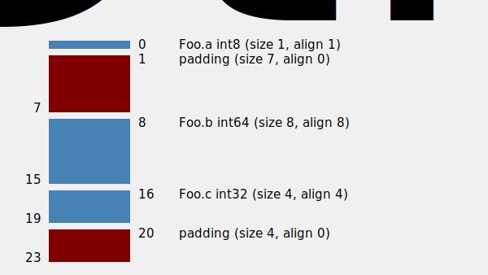

# Golang中的字节对齐

搞清楚几个问题：

- 为何要对齐
- 对齐的机制是什么
- 如何查看对齐情况
- 一个源码分析

## 实例

1、安装`structlayout`相关工具
```shell
go get -u honnef.co/go/tools
//显示结构体布局
go install honnef.co/go/tools/cmd/structlayout@latest
//重新设计struct字段 减少填充的数量
go install honnef.co/go/tools/cmd/structlayout-optimize@latest
// 用ASCII格式输出
go install honnef.co/go/tools/cmd/structlayout-pretty@latest

//第三方可视化
go install github.com/ajstarks/svgo/structlayout-svg@latest
```

2、需要分析的文件

[align.go](./align.go)

注意：

- `structlayout`工具要求待分析文件所在目录下必须有go.mod文件

3、进行structlayout分析，输出图片

```shell
// 命令如下:
structlayout -json file=./align.go Foo | structlayout-svg -t "Foo Struct" > Foo_struct.svg
```



## 参考文档

- [你的内存对齐了吗](https://zhuanlan.zhihu.com/p/355158723)
- []()